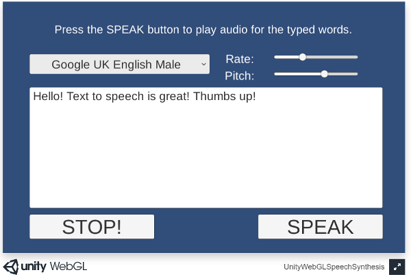

# UnityWebGLSpeechSynthesis
Unity WebGL Package For Speech Synthesis

# Target

The `Unity WebGL Speech Synthesis Package` is created for Unity version `5.5` or better.
This package is **only** intended for the `WebGL` platform and requires a browser with the built-in [Web Speech API](https://dvcs.w3.org/hg/speech-api/raw-file/tip/speechapi.html), like Chrome.
Speech Synthesis requires an Internet connection.
Check the [browser compatibility](https://developer.mozilla.org/en-US/docs/Web/API/Web_Speech_API#Browser_compatibility) to see which browsers implemented the `Speech API`.

## Supported Browsers

* Chrome
* Edge
* Firefox
* Safari

# Changelog

1.0 - Initial creation of the project

# Demos

[Demo 01 Unity Speech Synthesis](https://theylovegames.com/UnityWebGLSpeechSynthesis_01Synthesis/)

# Documentation

This document can be accessed in `Assets/WebGLSpeechSynthesis/Readme.pdf` or use the menuitem `GameObject->WebGLSpeechSynthesis->Online Documentation`

# Quick Start

1 Switch to the `WebGL` platform in `Build Settings [image_2](images/image_2.png)

2 Create one `WebGLSpeechSynthesisPlugin` GameObject in the scene with the menu `GameObject->WebGLSpeechSynthesis->Create WebGLSpeechSynthesisPlugion` [image_3](images/image_3.png)

3 (Optional) You may need a voices dropdown in your UI, use the menuitem `GameObject->WebGLSpeechSynthesis->Create Voices Dropdown` [image_4](images/image_4.png)

# Scenes

## Example01 - Speech Synthesis

The scene is located at `Assets/WebGLSpeechSynthesis/Scenes/Example01_Synthesis.unity`

# Support

Send questions and/or feedback to the support@theylovegames.com email.
