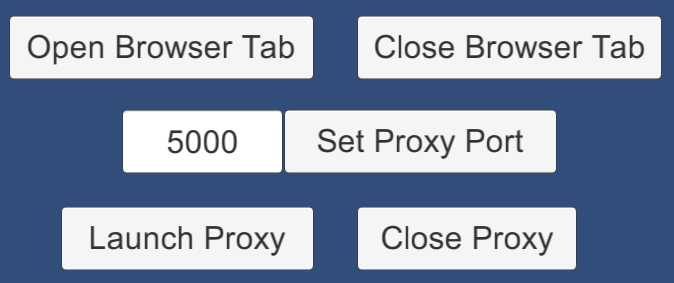

# UnityWebGLSpeechSynthesis
The WebGL For Speech Synthesis package is available in the [Unity Asset Store](https://www.assetstore.unity3d.com/en/#!/content/81861).

# See Also

The WebGL For Speech Detection package is available in the [Unity Asset Store](https://www.assetstore.unity3d.com/en/#!/content/81076).

# Supported Platforms

* WebGL

* Windows Standalone (using [Speech Proxy](https://github.com/tgraupmann/ChromeSpeechProxy))

* Windows Unity Editor (using [Speech Proxy](https://github.com/tgraupmann/ChromeSpeechProxy))

# Target

The `Unity WebGL Speech Synthesis Package` is created for Unity version `5.5` or better.
This package was originally created for the `WebGL` platform and supports other platforms using a [Speech Proxy](https://github.com/tgraupmann/ChromeSpeechProxy).
This package requires a browser with the built-in [Web Speech API](https://dvcs.w3.org/hg/speech-api/raw-file/tip/speechapi.html), like Chrome.
Synthesis requires an Internet connection.
Check the [browser compatibility](https://developer.mozilla.org/en-US/docs/Web/API/Web_Speech_API#Browser_compatibility) to see which browsers implemented the `Speech API`.

## Tested Browsers

* Chrome
* Edge
* Firefox
* Safari

# Changelog

1.0 - Initial creation of the project

1.1 - Added support for [Speech Proxy](https://github.com/tgraupmann/ChromeSpeechProxy)

# Demos

[Demo 01 Unity Speech Synthesis](https://theylovegames.com/UnityWebGLSpeechSynthesis_01Synthesis/)

# Documentation

This document can be accessed in `Assets/WebGLSpeechSynthesis/Readme.pdf` or use the menuitem `GameObject->WebGLSpeechSynthesis->Online Documentation`

# Sample Scenes

1 `Assets/WebGLSpeechSynthesis/Scenes/Example01Synthesis` - Uses WebGLSpeechSynthesisPlugin to do speech synthesis

2 `Assets/WebGLSpeechSynthesis/Scenes/Example02Proxy` - Uses ProxySpeechSynthesisPlugin to do speech synthesis

3 `Assets/WebGLSpeechDetection/Scenes/Example03_ProxyManagement`- Management methods for launching and modifying the proxy

# Modes

Synthesis modes use the same API interface other than where the instance comes from.

## WebGL Mode

The `WebGLSpeechSynthesisPlugin` uses native synthesis only for the WebGL platform.

```
ISpeechSynthesisPlugin speechSynthesisPlugin = WebGLSpeechSynthesisPlugin.GetInstance();
```

`WebGL` mode requires a `WebGLSpeechSynthesisPlugin` gameobject in the scene which can be created from the `GameObject->WebGLSpeechSynthesis->Create WebGLSpeechSynthesisPlugin` menu item.

## Proxy Mode

The `ProxySpeechSynthesisPlugin` uses a [Speech Proxy](https://github.com/tgraupmann/ChromeSpeechProxy) to do speech synthesis for non-WebGL platforms.

```
ISpeechSynthesisPlugin speechSynthesisPlugin = ProxySpeechSynthesisPlugin.GetInstance();
```

`Proxy` mode requires a `ProxySpeechSynthesisPlugin` gameobject in the scene which can be created from the `GameObject->WebGLSpeechSynthesis->Create ProxySpeechSynthesisPlugin` menu item.

Also a [Speech Proxy](https://github.com/tgraupmann/ChromeSpeechProxy) needs to be running for `Proxy` mode to work.

The `Proxy Port` is assigned by the `ProxySpeechSynthesisPlugin` gameobject with the inspector and needs to match the port used by the [Speech Proxy](https://github.com/tgraupmann/ChromeSpeechProxy).


# Quick Start

1 Switch to the `WebGL` platform in `Build Settings [image_2](images/image_2.png)

2 Create one `WebGLSpeechSynthesisPlugin` GameObject in the scene with the menu `GameObject->WebGLSpeechSynthesis->Create WebGLSpeechSynthesisPlugion` [image_3](images/image_3.png)

3 (Optional) You may need a voices dropdown in your UI, use the menuitem `GameObject->WebGLSpeechSynthesis->Create Voices Dropdown` [image_4](images/image_4.png)

4 At this point you should have a scene with the `WebGLSpeechSynthesisPlugin`, and (optionally) a voices dropdown added to the canvas.


5 Create a custom MonoBehaviour script to use the `WebGLSpeechSynthesis` API

6 Add a using statement to get access to the `WebGLSpeechSynthesis` namespace

```
using UnityWebGLSpeechSynthesis;
```

## Speech Synthesis Plugin Quick Setup

7 Add a reference for `WebGLSpeechSynthesisPlugin` to the script

```
        /// <summary>
        /// Reference to the plugin
        /// </summary>
        private ISpeechSynthesisPlugin _mSpeechSynthesisPlugin = null;
```

8 In the `start event` check if the plugin is available.

```
        // Use this for initialization
        IEnumerator Start()
        {
            // get singleton instance
            _mSpeechSynthesisPlugin = WebGLSpeechSynthesisPlugin.GetInstance();
            if (null == _mSpeechSynthesisPlugin)
            {
                Debug.LogError("WebGL Speech Synthesis Plugin is not set!");
                yield break;
            }

            // wait for proxy to become available
            while (!_mSpeechSynthesisPlugin.IsAvailable())
            {
                yield return null;
            }
        }
```

## Speak Quick Setup

9 Add a field to hold the utterance that will be spoken

```
        /// <summary>
        /// Reference to the utterance which holds the voice and text to speak
        /// </summary>
        private SpeechSynthesisUtterance _mSpeechSynthesisUtterance = null;
```

10 Create an instance of `SpeechSynthesisUtterance`

```
            // Create an instance of SpeechSynthesisUtterance
            _mSpeechSynthesisPlugin.CreateSpeechSynthesisUtterance((utterance) =>
            {
                //Debug.LogFormat("Utterance created: {0}", utterance._mReference);
                _mSpeechSynthesisUtterance = utterance;
            });
```

11 Speak the utterance

```
            // Cancel if already speaking
            _mSpeechSynthesisPlugin.Cancel();

            // Set the text that will be spoken
            _mSpeechSynthesisPlugin.SetText(_mSpeechSynthesisUtterance, _mInputField.text);

            // Use the plugin to speak the utterance
            _mSpeechSynthesisPlugin.Speak(_mSpeechSynthesisUtterance);
```

## Voice Selection Quick Setup

12 Add a field to hold the available voices

```
        /// <summary>
        /// Reference to the supported voices
        /// </summary>
        private VoiceResult _mVoiceResult = null;
```

13 Use the plugin to get the available voices

```
            _mSpeechSynthesisPlugin.GetVoices((voiceResult) =>
            {
                _mVoiceResult = voiceResult;
            });
```

14 Populate the voices dropdown using the voice result

```
                // prepare the voices drop down items
                SpeechSynthesisUtils.PopulateVoicesDropdown(_mDropdownVoices, _mVoiceResult);
```

15 Handle voice change events from the dropdown

```
                    // set up the drop down change listener
                    _mDropdownVoices.onValueChanged.AddListener(delegate {
                        // handle the voice change event, and set the voice on the utterance
                        SpeechSynthesisUtils.HandleVoiceChanged(_mDropdownVoices,
                            _mVoiceResult,
                            _mSpeechSynthesisUtterance,
                            _mSpeechSynthesisPlugin);
                        // Speak in the new voice
                        Speak();
                    });
```

# Scenes

## Example01 - Speech Synthesis

The scene is located at `Assets/WebGLSpeechSynthesis/Scenes/Example01_Synthesis.unity`


## Example02 - Proxy Synthesis

The scene is located at `Assets/WebGLSpeechSynthesis/Scenes/Example02_Proxy.unity`

The example code is nearly identical to the non-proxy example, except for getting the synthesis instance from `ProxySpeechSynthesisPlugin`.

```
            // get the singleton instance
            _mSpeechSynthesisPlugin = ProxySpeechSynthesisPlugin.GetInstance();
```

## Example03 - Proxy Management

The scene is located at `Assets/WebGLSpeechSynthesis/Scenes/Example03_ProxyManagement.unity`



# Support

Send questions and/or feedback to the support@theylovegames.com email.
