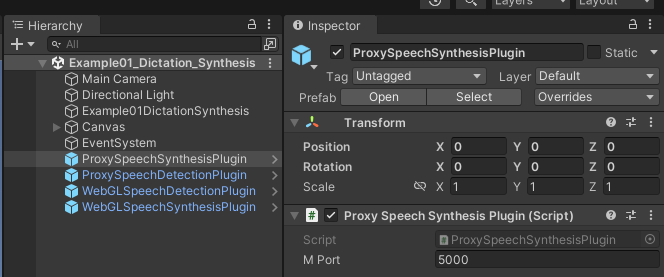

# UnityWebGLSpeechSynthesis

The `WebGL for Speech Synthesis` package is available in the [Unity Asset Store](https://www.assetstore.unity3d.com/en/#!/content/81861). [Online documentation](https://github.com/tgraupmann/UnityWebGLSpeechSynthesis) is available.

# See Also

* The `WebGL for Speech Detection` package is available in the [Unity Asset Store](https://www.assetstore.unity3d.com/en/#!/content/81076). [Online documentation](https://github.com/tgraupmann/UnityWebGLSpeechDetection) is available.

* The `WebGL Speech` package is available in the [Unity Asset Store](https://assetstore.unity.com/packages/tools/audio/webgl-speech-105831).
[Online documentation](https://github.com/tgraupmann/UnityWebGLSpeech) is available.

* Try the [Unity WebGL Speech Demos](https://theylovegames.com/UnityWebGLSpeech_Demos/)

# Supported Platforms

* WebGL

* Mac Standalone (using [Speech Proxy](https://github.com/tgraupmann/ConsoleChromeSpeechProxy))

* Mac Unity Editor (using [Speech Proxy](https://github.com/tgraupmann/ConsoleChromeSpeechProxy))

* Windows Standalone (using [Speech Proxy](https://github.com/tgraupmann/ConsoleChromeSpeechProxy))

* Windows Unity Editor (using [Speech Proxy](https://github.com/tgraupmann/ConsoleChromeSpeechProxy))

<table border="1"><tr><td>
Note: WebGL builds use the built-in browser to use the Speech API on PC/Mac/Android/iOS. In order to use the Speech API in standalone builds and in the Unity Editor, you will need to configure and run the free <a target="_blank" href="https://github.com/tgraupmann/ConsoleChromeSpeechProxy">Speech Proxy</a>.


The demo scenes have game objects to support the WebGL Plugins and the `Speech Proxy`.



With the `Speech Proxy` running, open a browser tab that relays `Speech API` calls to and from the browser.


Only the `WebGL Speech` package in the [Unity Asset Store](https://assetstore.unity.com/packages/tools/audio/webgl-speech-105831) has example scenes that show using `Speech Detection` and `Speech Synthesis` together.
</td></tr></table>

# Target

The `WebGL for Speech Synthesis` package is created for Unity version `5.3` or better. This includes support for Unity 2017.X, 2018.X, 2019.X, and 2021.X.
This package was originally created for the `WebGL` platform and supports other platforms using a `Speech Proxy`.
This package requires a browser with the built-in [Web Speech API](https://dvcs.w3.org/hg/speech-api/raw-file/tip/speechapi.html), like Chrome.
Synthesis requires an Internet connection.
Check the [browser compatibility](https://developer.mozilla.org/en-US/docs/Web/API/Web_Speech_API#Browser_compatibility) to see which browsers implemented the `Speech API`.

## Tested Browsers

* Chrome
* Edge
* Firefox
* Safari

# Changelog

1.0 - Initial creation of the project

1.1 - Added support for `Speech Proxy`

1.2 - Minor fixes

1.3 - Added support for speech synthesis in edit mode

1.4 - Added support for `MacOS` for `play-mode` and `edit-mode`

1.5 - Added example without GUI

1.6 - Added buffering for language data

1.7 - Cleaned up sample code

1.8 - Updated sample scenes to use default 5000 port

1.9 - Added support for 2018.X, 2019.X, and 2021.X.

# Demos

[Demo 01 Unity Speech Synthesis](https://theylovegames.com/UnityWebGLSpeechSynthesis_01Synthesis/)

# Documentation

This document can be accessed in `Assets/WebGLSpeechSynthesis/Readme.pdf` or use the menuitem `GameObject->WebGLSpeechSynthesis->Online Documentation`

# FAQ

* To avoid constant Microphone security prompts, host WebGL builds on secure HTTPS sites. Take a look at the online demos to see how that works.

* Speech can work on mobile as a WebGL build. Launch the Chrome browser app on mobile and load your WebGL page in the Chrome app.

* WebGL can take a long while to build. For faster development, try the [Speech Proxy](https://github.com/tgraupmann/ConsoleChromeSpeechProxy). This enables speech in the editor and standalone Windoows/Mac builds without the long wait times.

* Sometimes the browser speech mechanism can crash. It can happen. If speech stops working, just close all of the browser windows and relaunch which should fix the issue.

<table border="1"><tr><td>
Note: In December of 2018, Chrome added a speech restriction that the speak() method can't be invoked until a web page has some user interaction.

<https://www.chromestatus.com/feature/5687444770914304>
</td></tr></table>

# Sample Scenes

***These sample scenes are located in the `Assets/WebGLSpeechSynthesis/` folder:***

1 `Scenes/Example01Synthesis` - Uses WebGLSpeechSynthesisPlugin to do speech synthesis

2 `Scenes/Example02Proxy` - Uses ProxySpeechSynthesisPlugin to do speech synthesis

3 `Scenes/Example03ProxyManagement` - Management methods for launching and modifying the proxy

4 `Scenes/Example04SbaitsoClone` - Clone of a classic text to speech demo

***These sample scenes are located in the `Assets/WebGLSpeechSynthesis/Editor/` folder:***

5 `Example05PanelSynthesis.cs` - Unity editor panel for speech synthesis that works in play mode and edit mode

***These sample scenes are located in the `Assets/WebGLSpeechSynthesis/` folder:***

6 `Scenes/Example06NoGUI` - Speech synthesis example without a GUI

7 `Scenes/Example07Buttons` - Speech synthesis where buttons uses random voices

# Modes

Synthesis modes use the same API interface other than where the instance comes from.

## WebGL Mode

The `WebGLSpeechSynthesisPlugin` uses native synthesis only for the WebGL platform.

```
ISpeechSynthesisPlugin speechSynthesisPlugin = WebGLSpeechSynthesisPlugin.GetInstance();
```

`WebGL` mode requires a `WebGLSpeechSynthesisPlugin` gameobject in the scene which can be created from the `GameObject->WebGLSpeechSynthesis->Create WebGLSpeechSynthesisPlugin` menu item.

## Proxy Mode

The `ProxySpeechSynthesisPlugin` uses a `Speech Proxy` to do speech synthesis for non-WebGL platforms.

```
ISpeechSynthesisPlugin speechSynthesisPlugin = ProxySpeechSynthesisPlugin.GetInstance();
```

`Proxy` mode requires a `ProxySpeechSynthesisPlugin` gameobject in the scene which can be created from the `GameObject->WebGLSpeechSynthesis->Create ProxySpeechSynthesisPlugin` menu item.

Also a `Speech Proxy` needs to be running for `Proxy` mode to work.

The `Proxy Port` is assigned by the `ProxySpeechSynthesisPlugin` gameobject with the inspector and needs to match the port used by the `Speech Proxy`.


# Quick Start

1 Switch to the `WebGL` platform in `Build Settings [image_2](images/image_2.png)

2 Create one `WebGLSpeechSynthesisPlugin` GameObject in the scene with the menu `GameObject->WebGLSpeechSynthesis->Create WebGLSpeechSynthesisPlugion` [image_3](images/image_3.png)

3 (Optional) You may need a voices dropdown in your UI, use the menuitem `GameObject->WebGLSpeechSynthesis->Create Voices Dropdown` [image_4](images/image_4.png)

4 At this point you should have a scene with the `WebGLSpeechSynthesisPlugin`, and (optionally) a voices dropdown added to the canvas.


5 Create a custom MonoBehaviour script to use the `WebGLSpeechSynthesis` API

6 Add a using statement to get access to the `WebGLSpeechSynthesis` namespace

```
using UnityWebGLSpeechSynthesis;
```

## Speech Synthesis Plugin Quick Setup

7 Add a reference for `WebGLSpeechSynthesisPlugin` to the script

```
/// <summary>
/// Reference to the plugin
/// </summary>
private ISpeechSynthesisPlugin _mSpeechSynthesisPlugin = null;
```

8 In the `start event` check if the plugin is available.

```
// Use this for initialization
IEnumerator Start()
{
    // get singleton instance
    _mSpeechSynthesisPlugin = WebGLSpeechSynthesisPlugin.GetInstance();
    if (null == _mSpeechSynthesisPlugin)
    {
        Debug.LogError("WebGL Speech Synthesis Plugin is not set!");
        yield break;
    }

    // wait for proxy to become available
    while (!_mSpeechSynthesisPlugin.IsAvailable())
    {
        yield return null;
    }
}
```

## Speak Quick Setup

9 Add a field to hold the utterance that will be spoken

```
/// <summary>
/// Reference to the utterance which holds the voice and text to speak
/// </summary>
private SpeechSynthesisUtterance _mSpeechSynthesisUtterance = null;
```

10 Create an instance of `SpeechSynthesisUtterance`

```
// Create an instance of SpeechSynthesisUtterance
_mSpeechSynthesisPlugin.CreateSpeechSynthesisUtterance((utterance) =>
{
    //Debug.LogFormat("Utterance created: {0}", utterance._mReference);
    _mSpeechSynthesisUtterance = utterance;
});
```

11 Speak the utterance

```
// Cancel if already speaking
_mSpeechSynthesisPlugin.Cancel();

// Set the text that will be spoken
_mSpeechSynthesisPlugin.SetText(_mSpeechSynthesisUtterance, _mInputField.text);

// Use the plugin to speak the utterance
_mSpeechSynthesisPlugin.Speak(_mSpeechSynthesisUtterance);
```

## Voice Selection Quick Setup

12 Add a field to hold the available voices

```
/// <summary>
/// Reference to the supported voices
/// </summary>
private VoiceResult _mVoiceResult = null;
```

13 Use the plugin to get the available voices

```
_mSpeechSynthesisPlugin.GetVoices((voiceResult) =>
{
    _mVoiceResult = voiceResult;
});
```

14 Select the desired voice from the voice result

```
if (null != _mVoiceResult &&
    null != _mVoiceResult.voices)
{
    for (int i = 0; i < _mVoiceResult.voices.Length; ++i)
    {
        Voice voice = _mVoiceResult.voices[i];
        if (null == voice)
        {
            continue;
        }
        // select voice by display name
        if (!string.IsNullOrEmpty(voice.display))
        {
            options.Add(voice.display);
        }
        // select voice by name
        else if (!string.IsNullOrEmpty(voice.name))
        {
            options.Add(voice.name);
        }
    }
}
```

15 Set the voice on the utterance

```
_mSpeechSynthesisPlugin.SetVoice(_mSpeechSynthesisUtterance, voice);
```

16 Set text on the utterance and call `Speak`

```
// Set the text that will be spoken
_mSpeechSynthesisPlugin.SetText(_mSpeechSynthesisUtterance, text);

// Use the plugin to speak the utterance
_mSpeechSynthesisPlugin.Speak(_mSpeechSynthesisUtterance);
```

## Proxy Management

17 Launch the `Speech Proxy`

```
// get the singleton instance
_mSpeechSynthesisPlugin = ProxySpeechSynthesisPlugin.GetInstance();

// check the reference to the plugin
if (null != _mSpeechSynthesisPlugin)
{
    // launch the proxy
    _mSpeechSynthesisPlugin.ManagementLaunchProxy();
}
```

18 Set Proxy Port

```
int port = 5000;
_mSpeechSynthesisPlugin.ManagementSetProxyPort(port);
```

19 Open Browser Tab

```
_mSpeechSynthesisPlugin.ManagementOpenBrowserTab();
```

20 Close Browser Tab

```
_mSpeechSynthesisPlugin.ManagementCloseBrowserTab();
```

21 Close Proxy

```
_mSpeechSynthesisPlugin.ManagementCloseProxy();
```

## Detect Synthesis On End Events

22 After the plugin is initialized, subscribe to `SynthesisOnEnd` events.

```
// Use this for initialization
IEnumerator Start()
{
 _mSpeechSynthesisPlugin = SpeechSynthesisUtils.GetInstance();
 if (null == _mSpeechSynthesisPlugin)
 {
  Debug.LogError("Speech Synthesis Plugin is not set!");
  yield break;
 }

 // subscribe to events
 _mSpeechSynthesisPlugin.AddListenerSynthesisOnEnd(HandleSynthesisOnEnd);
}
```

23 The `SynthesisOnEnd` callback will fire when Speak() completes

```
void HandleSynthesisOnEnd(SpeechSynthesisEvent speechSynthesisEvent)
{
}
```

## Set A Default Voice

```
/// <summary>
/// Speak the utterance
/// </summary>
public void Speak(string text)
{
    if (null == _mSpeechSynthesisUtterance)
    {
        Debug.LogError("Utterance is not set!");
        return;
    }

    if (string.IsNullOrEmpty(text))
    {
        return;
    }

    if (!_mVoicesSet)
    {
        return;
    }

    if (!_mUtteranceSet)
    {
        return;
    }

    // set a default voice
    if (null != _mVoiceResult &&
        null != _mVoiceResult.voices &&
        _mVoiceResult.voices.Length > 0)
    {
        for (int index = 0; index < _mVoiceResult.voices.Length; ++index)
        {
            Voice voice = _mVoiceResult.voices[index];
            if (null != voice &&
                voice.name == "Google US English")
            {
                _mSpeechSynthesisPlugin.SetVoice(_mSpeechSynthesisUtterance, voice);
                break;
            }
        }
    }

    // Cancel if already speaking
    _mSpeechSynthesisPlugin.Cancel();

    // Set the text that will be spoken
    _mSpeechSynthesisPlugin.SetText(_mSpeechSynthesisUtterance, text);

    // Use the plugin to speak the utterance
    _mSpeechSynthesisPlugin.Speak(_mSpeechSynthesisUtterance);
}
```

# Scenes

## Example01 - Speech Synthesis

The scene is located at `Assets/WebGLSpeechSynthesis/Scenes/Example01Synthesis.unity`

The example source is located at `Assets/WebGLSpeechSynthesis/Scripts/Example01Synthesis.cs`.


## Example02 - Proxy Synthesis

The scene is located at `Assets/WebGLSpeechSynthesis/Scenes/Example02Proxy.unity`

The example source is located at `Assets/WebGLSpeechSynthesis/Scripts/Example02Proxy.cs`.

The example code is nearly identical to the non-proxy example, except for getting the synthesis instance from `ProxySpeechSynthesisPlugin`.

```
// get the singleton instance
_mSpeechSynthesisPlugin = ProxySpeechSynthesisPlugin.GetInstance();
```

## Example03 - Proxy Management

The scene is located at `Assets/WebGLSpeechSynthesis/Scenes/Example03ProxyManagement.unity`.

The example source is located at `Assets/WebGLSpeechSynthesis/Scripts/Example03ProxyManagement.cs`.


## Example04 - Sbaitso Clone

The scene is located at `Assets/WebGLSpeechSynthesis/Scenes/Example04SbaitsoClone.unity`.

The example source is located at `Assets/WebGLSpeechSynthesis/Scripts/Example04SbaitsoClone.cs`.

The AI is controlled from `Assets/WebGLSpeechSynthesis/Scripts/AISbaitso.cs` which is a port from `JAVA`.

The example is a clone of the classic `Dr. Sbaitso Demo` that was bundled with `Sound Blaster Pro Audio Cards` which showcased text to speech in the `1990s`.


## Example05 - Panel Synthesis

The editor panel script is located at `Assets/WebGLSpeechSynthesis/Editor/Example05PanelSynthesis.cs` and is activated via the `Window->WebGLSpeechSynthesis->Open Example05PanelSynthesis` menu item.

The example panel shows speech synthesis working in edit and play modes.

The panel example uses the `EditorProxySpeechSynthesisPlugin` to proxy the speech api in `edit` mode.

## Example06 - No GUI

The scene is located at `Assets/WebGLSpeechSynthesis/Scenes/Example06NoGUI.unity`

The example source is located at `Assets/WebGLSpeechSynthesis/Scripts/Example06NoGUI.cs`.

## Example07 - Buttons

The scene is located at `Assets/WebGLSpeechSynthesis/Scenes/Example07Buttons.unity`

The example source is located at `Assets/WebGLSpeechSynthesis/Scripts/Example07Buttons.cs`.

# FAQ

Q: How do I integrate with RT_Voice?

Within the RT-Voice package, there is a demo scene called "WebGL_Demo". RT-Voice provides a 3rd party package for your asset and a prefab "WebGL Speech Synthesis", which has to be added to the scene and the "RTVoice"-prefab.

Add the "WebGL Speech Synthesis"-prefab as "Custom Provider":


# Support

Send questions and/or feedback to the support@theylovegames.com email.

Support is also available in Discord, you can reach me at `Tim Graupmann#0611`.
